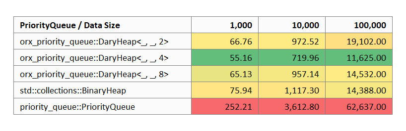
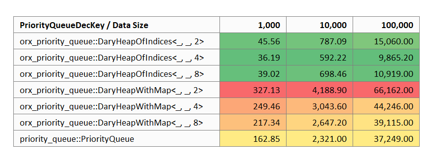

# orx-priority-queue

Priority queue traits and efficient d-ary heap implementations.

## A. Motivation

### A.1. Priority Queue Traits

This crate aims to provide algorithms with the abstraction over priority queues. In order to achieve this, two traits are defined: **`PriorityQueue<N, K>`** and **`PriorityQueueDecKey<N, K>`**. The prior is a simple queue while the latter extends it by providing additional methods to change priorities of the items that already exist in the queue.

The separation is important since additional operations often requires the implementors to allocate internal memory for bookkeeping. Therefore, we would prefer `PriorityQueueDecKey<N, K>` only when we need to change the priorities.

### A.2. d-ary Heap Implementations

Three categories of d-ary heap implementations are provided.

**`DaryHeap<N, K, const D: usize>`** is the basic queue implementing `PriorityQueue<N, K>`. As mentioned before, it is to be preferred unless priority updates, decrease-key operations, are required.

The following two types additionally implement `PriorityQueueDecKey<N, K>` which serve different purposes:

* **`DaryHeapOfIndices<N, K, const D>`** is a d-ary heap paired up with a positions array. It requires the nodes to implement `HasIndex` trait which is nothing but `fn index(&self) -> usize`. Further, it requires the maximum index that is expected to enter the queue (candidates coming from a closed set). Once these conditions are satisfied, it performs **significantly faster** than the alternative decrease key queues.
  * Although the closed set requirement might sound strong, it is often satisfied in mathematical algorithms. For instance, for most network traversal algorithms, the candidates set is the nodes of the graph.
* **`DaryHeapWithMap<N, K, const D: usize>`** is a d-ary heap paired up with a positions `HashMap` (`BTreeMap` with no-std). This provides the open-set flexibility and fits better to more general cases, rather than mathematical algorithms. 

All three variants of the d-ary heap implementations take complete benefit of const generics to speed up traversal on the three when d is a power of two.

In addition the the following implementations are provided in this crate:

* `std::collections::BinaryHeap<(N, K)>` implements `PriorityQueue<N, K>`,
* `priority_queue:PriorityQueue<N, K>` impelements both `PriorityQueue<N, K>` and `PriorityQueueDecKey<N, K>`.

This allows to use all the queue implementations interchangeably and conveniently measure performance. See <a href="#section-benchmarks">B. Benchmarks</a> section to see the results.

### A.3. Why to Decrease Key?

Decrease key operations are critical in certain cases.

Assume a scenario where the same candidate node might be evaluated multiple times with different priorities throughout the life of the queue. Just as in Dijkstra's shortest path algorithm.

We can handle this with a basic `PriorityQueue` as follows:

* every time a node is observed as a candidate with a given priority, we push it again to the priority queue;
* this means that we will pop the same node multiple times with priorities in worsening order;
* we additionally book keep marking each node from the queue;
* when we pop the same node the second or third time, we simply ignore it.

This approach might work well in many cases. The problem it might casue is mostly memory related. If we assume that the algorithm using the queue is the Dijkstra's shortest path, and if our graph has N nodes, each node can enter the queue N times in the worst case. This would lead to a space complexity of O(N^2).

On the other hand, with a `PriorityQueueDecKey`, each time we observe a candidate with a priority:

* we can push the (node, priority) if it doesn't exist in the queue,
* we can decrease its priority on the queue if it exists in the queue with a worse priority,
* or lastly, we can ignore the candidate if the node already exists in the queue with a better priority.

This approach would guarantee that each node enters the queue at most once. It would, for instance, reduce the space complexity of the Dijkstra's shortest path to O(N). Another benefit of this approach is to push some part of the book keeping to the queue allowing the algorithm to be more concise. For instance, `try_decrease_key_or_push` method removes almost all book keeping from Dijkstra's shortest path algorithm.

However, there is not a clear winner. Most performant queue often depends on the input data and can empirically be decided. As mentioned, allowing these experiments and benchmarks is one of the key motivations behind the priority queue traits. You may see such an exercise in the repository [https://github.com/orxfun/orx-bench-shortest-path](https://github.com/orxfun/orx-bench-shortest-path).


<div id="section-benchmarks"></div>

## B. Benchmarks

`DaryHeap` implementations provided performs comparable (slightly faster) than `std::collections::BinaryHeap` and significantly faster than decrease key variants.

`DaryHeapOfIndices` performs significantly faster than other tested priority queues with decrease key operations.

### B.1. Basic Queue Operations

This benchmark compares basic push & pop operations on different `PriorityQueue` implementations. See "benches/basic_queue.rs" for details. The computation times in µs for different test data sizes are presented in the following table.



<!-- 
| PriorityQueue / Data Size             |  1,000 |   10,000 |   100,000 |
|---------------------------------------|-------:|---------:|----------:|
| orx_priority_queue::DaryHeap<_, _, 2> |  66.76 |   972.52 | 19,102.00 |
| orx_priority_queue::DaryHeap<_, _, 4> |  **55.16** |   **719.96** | **11,625.00** |
| orx_priority_queue::DaryHeap<_, _, 8> |  65.13 |   957.14 | 14,532.00 |
| std::collections::BinaryHeap          |  75.94 | 1,117.30 | 14,388.00 |
| priority_queue::PriorityQueue         | 252.21 | 3,612.80 | 62,637.00 |
-->

* `DaryHeap` implementations with different d-values and `std::collections::BinaryHeap` perform at a similar scale.
  * Among these, `DaryHeap<_, _, 4>` performs consistently faster.
* `priority_queue::PriorityQueue` is around five times slower.

### B.2. Decrease Key Operations

In the next benchmark, different `PriorityQueueDecKey` implementations are tested on a benchmark where decrease key calls are made in addition to push & pop operations. See "benches/deckey_queue.rs" for details. The computation times in µs for different test data sizes are presented in the following table. Since `std::collections::BinaryHeap` does not provide the required methods it is excluded from the analysis.



<!-- 
| PriorityQueueDecKey / Data Size                |  1,000 |   10,000 |   100,000 |
|------------------------------------------------|-------:|---------:|----------:|
| orx_priority_queue::DaryHeapOfIndices<_, _, 2> |  45.56 |   787.09 | 15,060.00 |
| orx_priority_queue::DaryHeapOfIndices<_, _, 4> |  **36.19** |   **592.22** |  **9,865.20** |
| orx_priority_queue::DaryHeapOfIndices<_, _, 8> |  39.02 |   698.46 | 10,919.00 |
| orx_priority_queue::DaryHeapWithMap<_, _, 2>   | 327.13 | 4,188.90 | 66,162.00 |
| orx_priority_queue::DaryHeapWithMap<_, _, 4>   | 249.46 | 3,043.60 | 44,246.00 |
| orx_priority_queue::DaryHeapWithMap<_, _, 8>   | 217.34 | 2,647.20 | 39,115.00 |
| priority_queue::PriorityQueue                  | 162.85 | 2,321.00 | 37,249.00 |
-->

* There are three clusters with respect to performance:
  * `DaryHeapOfIndices` is significantly faster than others (~5 times faster than `DaryHeapWithMap` and ~3.5 times faster than `priority_queue::PriorityQueue`),
  * `priority_queue::PriorityQueue` is around 1.5 times faster than `DaryHeapWithMap`, and
  * `DaryHeapWithMap` is the slowest.
* Among all variants, `DaryHeapOfIndices<_, _, 4>` consistently outperforms the others.


## C. Examples

### C.1. Basic Usage

```rust
use orx_priority_queue::*;

// generic over simple priority queues
fn test_priority_queue<P>(mut pq: P)
where
    P: PriorityQueue<usize, f64>,
{
    pq.clear();

    pq.push(0, 42.0);
    assert_eq!(Some(&0), pq.peek().map(|x| x.node()));
    assert_eq!(Some(&42.0), pq.peek().map(|x| x.key()));

    let popped = pq.pop();
    assert_eq!(Some((0, 42.0)), popped);
    assert!(pq.is_empty());

    pq.push(0, 42.0);
    pq.push(1, 7.0);
    pq.push(2, 24.0);
    pq.push(10, 3.0);

    while let Some(popped) = pq.pop() {
        println!("pop {:?}", popped);
    }
}

// generic over decrease-key priority queues
fn test_priority_queue_deckey<P>(mut pq: P)
where
    P: PriorityQueueDecKey<usize, f64>,
{
    pq.clear();

    pq.push(0, 42.0);
    assert_eq!(Some(&0), pq.peek().map(|x| x.node()));
    assert_eq!(Some(&42.0), pq.peek().map(|x| x.key()));

    let popped = pq.pop();
    assert_eq!(Some((0, 42.0)), popped);
    assert!(pq.is_empty());

    pq.push(0, 42.0);
    assert!(pq.contains(&0));

    pq.decrease_key(&0, 7.0);
    assert_eq!(Some(&0), pq.peek().map(|x| x.node()));
    assert_eq!(Some(&7.0), pq.peek().map(|x| x.key()));

    let deckey_result = pq.try_decrease_key(&0, 10.0);
    assert!(matches!(ResTryDecreaseKey::Unchanged, deckey_result));
    assert_eq!(Some(&0), pq.peek().map(|x| x.node()));
    assert_eq!(Some(&7.0), pq.peek().map(|x| x.key()));

    while let Some(popped) = pq.pop() {
        println!("pop {:?}", popped);
    }
}

// d-ary heap generic over const d
const D: usize = 4;

test_priority_queue(DaryHeap::<usize, f64, D>::default());
test_priority_queue(DaryHeapWithMap::<usize, f64, D>::default());
test_priority_queue(DaryHeapOfIndices::<usize, f64, D>::with_index_bound(100));

test_priority_queue_deckey(DaryHeapWithMap::<usize, f64, D>::default());
test_priority_queue_deckey(DaryHeapOfIndices::<usize, f64, D>::with_index_bound(100));

// or type aliases for common heaps to simplify signature
// Binary or Quarternary to fix d of d-ary
test_priority_queue(BinaryHeap::default());
test_priority_queue(BinaryHeapWithMap::default());
test_priority_queue(BinaryHeapOfIndices::with_index_bound(100));
test_priority_queue_deckey(QuarternaryHeapOfIndices::with_index_bound(100));
```

### C.2. Usage in Dijkstra's Shortest Path

Below are some additional traits we need to set up the example.

```rust
type Weight = u32;
pub trait OutEdgeData {
    fn head(&self) -> usize;
    fn weight(&self) -> Weight;
}
pub trait OutEdges {
    type Edge: OutEdgeData;
    fn next_edge(&mut self) -> Option<Self::Edge>;
    fn count_edges(&mut self) -> usize;
}
pub trait Graph {
    type OutEdges<'a>: OutEdges where where Self:'a;
    fn num_nodes(&self) -> usize;
    fn out_edges(&self, node: usize) -> Self::OutEdges<'_>;
}
```

You may see below two implementations one using a `PriorityQueue` and the other with a `PriorityQueueDecKey`.

```rust
use orx_priority_queue::*;

fn run_with_basic_pq<G: Graph, Q: PriorityQueue<usize, Weight>>(
    graph: &G,
    queue: &mut Q,
    source: usize,
    sink: usize,
) -> Option<Weight> {
    // reset
    queue.clear();
    let mut dist = vec![Weight::MAX; graph.num_nodes()];

    // init
    dist[source] = 0;
    queue.push(source, 0);

    // iterate
    while let Some((node, cost)) = queue.pop() {
        if node == sink {
            return Some(cost);
        } else if cost > dist[node] {
            continue;
        }

        let mut out_edges = graph.out_edges(node);
        while let Some(edge) = out_edges.next_edge() {
            let (head, weight) = (edge.head(), edge.weight());
            let next_cost = cost + weight;
            if next_cost < dist[head] {
                queue.push(head, next_cost);
                dist[head] = next_cost;
            }
        }
    }

    None
}

fn run_with_pq_deckey<G: Graph, Q: PriorityQueueDecKey<usize, Weight>>(
    graph: &G,
    queue: &mut Q,
    source: usize,
    sink: usize,
) -> Option<Weight> {
    // reset
    queue.clear();
    let mut visited = vec![false; graph.num_nodes()];

    // init
    visited[source] = true;
    queue.push(source, 0);

    // iterate
    while let Some((node, cost)) = queue.pop() {
        if node == sink {
            return Some(cost);
        }

        let mut out_edges = graph.out_edges(node);
        while let Some(edge) = out_edges.next_edge() {
            let (head, weight) = (edge.head(), edge.weight());
            if !visited[head] {
                // this call will:
                // * push the `head` if not present in the queue, or
                // * decrease its priority to `cost + weight` if it was greater, or
                // * leave the queue untouched otherwise.
                queue.try_decrease_key_or_push(&head, cost + weight);
            }
        }
        visited[node] = true;
    }

    None
}
```

## License

This library is licensed under MIT license. See LICENSE for details.
